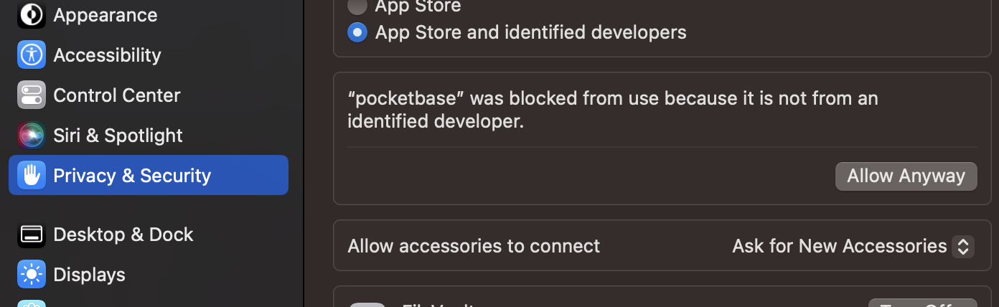

# 테킷 멋쟁이사자처럼 React 설치 가이드

- [테킷 멋쟁이사자처럼 React 설치 가이드](#테킷-멋쟁이사자처럼-react-설치-가이드)
  - [환경 설정](#환경-설정)
    - [vite 설정](#vite-설정)
    - [tailwind 설치](#tailwind-설치)
    - [react router 설치](#react-router-설치)
    - [posketbase 설치\_backend server](#posketbase-설치_backend-server)
    - [posketbase 설치\_SDK](#posketbase-설치_sdk)
    - [절대 경로 설정](#절대-경로-설정)
    - [맥의 경우 시스템 환경설정](#맥의-경우-시스템-환경설정)
    - [jsconfig.json](#jsconfigjson)
    - [jsconfig.json](#jsconfigjson-1)
    - [.eslintrc.cjs](#eslintrccjs)

## 환경 설정

### vite 설정

```
pnpm create vite@latest 폴더명
cd 폴더명
```

CSS 결정
css || css module || tailwind || scss

### tailwind 설치

```
pnpm add -D tailwindcss postcss autoprefixer postcss-import
pnpm tailwindcss init -p
```

```css
/* tailwind.css */
@import "tailwindcss/base";
@import "tailwindcss/components";
@import "tailwindcss/utilities";

/* import './styles/tailwind.css' */
/* tailwind.css 파일 생성 후 최상위 main.jsx 파일에서 import */

/* tailwind.config.js */
content: [ "./index.html", "./src/**/*.jsx"];
```

### react router 설치

```
pnpm add react-router-dom
```

### posketbase 설치\_backend server

https://pocketbase.io/docs/

OS에 맞는 파일 다운로드 후
압축 풀고
프로젝트 폴더에 최상단에 위치
(폴더명은 pocketbase로 변경)

```js
/* package.json */
"pocketbase": ".\\pocketbase\\pocketbase serve"
```

### posketbase 설치\_SDK

```
pnpm add pocketbase
```

### 절대 경로 설정

```js
/* vite.config.js */
resolve: {
  alias: {
    '@': path.resolve(__dirname, './src'),
  },
},

/* jsconfig.json */
{
  "compilerOptions": {
    "baseUrl": ".",
    "paths": {
      "@/*": ["src/*"],
    }
  }
}
```

### 맥의 경우 시스템 환경설정


맥은 보안 문제로 시스템-보안-pocketbase allow 해줘야 함

```bash
pocketbase/pocketbase serve
```

### jsconfig.json

```jsx
module.exports = {
  root: true,
  env: { browser: true, es2020: true, node: true },
  extends: [
    "eslint:recommended",
    "plugin:react/recommended",
    "plugin:react/jsx-runtime",
    "plugin:react-hooks/recommended",
  ],
  ignorePatterns: ["dist", ".eslintrc.cjs"],
  parserOptions: { ecmaVersion: "latest", sourceType: "module" },
  settings: { react: { version: "18.2" } },
  plugins: ["react-refresh"],
  rules: {
    "react/prop-types": "off",
    "react-refresh/only-export-components": [
      "warn",
      { allowConstantExport: true },
    ],
  },
};
```

### jsconfig.json

선택사항

```jsx
{
  "compilerOptions": {
    "baseUrl": ".",
    "paths": {
      "@/*": ["src/*"],
    }
  }
}
```

### .eslintrc.cjs

```jsx
  extends: [
    // 기본 규칙 외에 다른 규칙을 추가로 사용하도록 설정합니다.
    'eslint:recommended',
    'plugin:prettier/recommended',
    // 여기서는 eslint: recommended와 plugin: prettier / recommended을 사용합니다.
  ],
  plugins: ['prettier'],
  // Prettier를 사용할 수 있도록 추가 설정합니다.
```

### prop-types
`pnpm add prop-types`

### helmet
각 페이지별로 파비콘 옆의 페이지 이름 변경 가능 (선택)
`pnpm add react-helmet-async`

